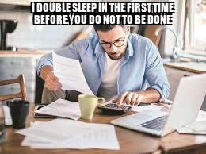
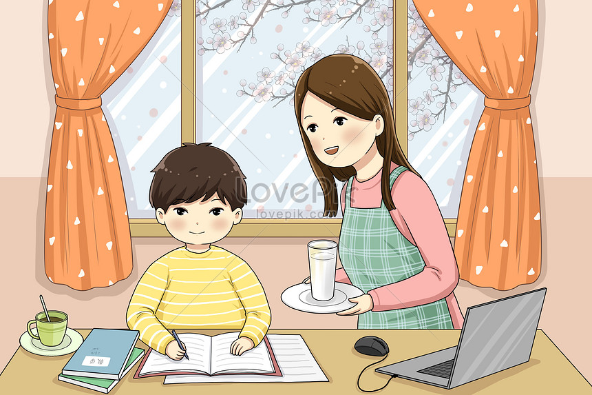
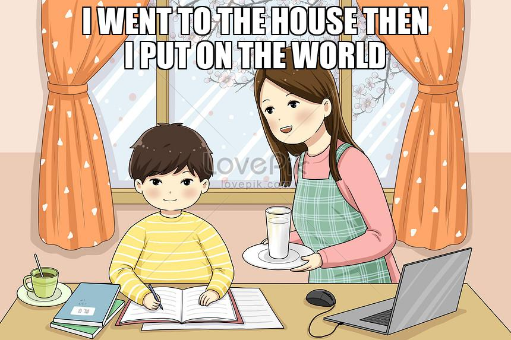

# Humournet

humournet is a set of CLI tools that will let you evaluate your image and outputs a humorous caption.
The goal of this project is to provide a little humour despite our current global pandemic because I believe that laughter is the best medicine. 

## Dataset

"memegenerator.net" is a free online image maker that allows user to add custom resizable text to images, it is also a popular repository of our favorite memes. 
Data was scraped from this site using scraper.py that outputs the saved images and csv file where the captions for each images are stored. 
These images and captions are then preprocess by extracting image features, perform text processing, text tokenization, and word embeddings before passing it to our model.

## Model Architecture

It uses EfficientNetB2 to extract image features and connects it to a fully connected layer as an encoder, it is then pass to the decoder having LSTM layers with visual attention.

## Results

Since during these pandemic days many companies are switching to work from home operation, Let's generate a caption to a man working from home :computer: :house:.

| input     | output      |
|------------|-------------|
|  |  |

This AI is hilarious :joy:. Of course you don't want to sleep at work, and it should be done unless you are going to be :fire:

Let's try another one for a kid having some online learning class.
| input     | output      |
|------------|-------------|
|  |  |

Hmmm.. I think our AI is implying that we should start from our home before putting a mark in the world :earth_asia: 

## Usage

Before anything else, please make sure to satisfy all of the prerequisites found in <a href="requirements.txt">requirements.txt</a>. OK, now that we are ready you can have your humorous captioning AI by excuting the following scripts sequentially:

1. Scrape images from <a href="https://memegenerator.net/">memegenerator.net</a>.
```
python scraper.py
```

2. Train your models
```
python train.py --num_epochs 15 --load_models 0
```
You can have full control on the hyperparameters for your training but the above code works the best for me.

3. Generate your memes! 
```
python generate_meme.py --img_path <your_image_location>
```

## Authors

* **Patrick La Rosa**
    * [Github](https://github.com/pgplarosa)
    * [LinkedIn](https://www.linkedin.com/in/patricklarosa)

## References
1. <a href="https://arxiv.org/pdf/1502.03044.pdf">Show, Attend and Tell: Neural Image Caption Generation with Visual Attention</a>
2. <a href="https://arxiv.org/pdf/1409.0473.pdf">Neural Machine Translation by Jointly Learning to Align and Translate</a>
